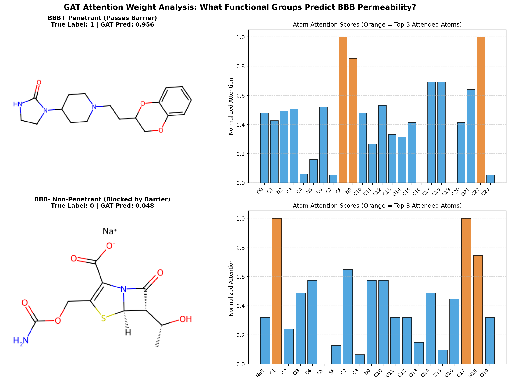

# Blood-Brain Barrier Prediction & Molecular Graph Representation Learning

[](https://www.python.org/downloads/)
[](https://pyg.org/)
[](https://moleculenet.org/)

A deep learning framework for predicting molecular properties—specifically **Blood-Brain Barrier Penetration (BBBP)** and **Beta-secretase 1 inhibition (BACE)**—using Graph Neural Networks (GNNs).

This project benchmarks **Graph Convolutional Networks (GCN)**, **Graph Attention Networks (GAT)**, and **GraphSAGE** under rigorous **Bemis-Murcko scaffold splitting**, providing both quantitative performance evaluations and qualitative interpretability via multi-head attention weight extraction.

---

## 📌 Key Highlights

- **Rigorous Chemical Splitting**: Uses **Bemis-Murcko scaffold splitting** ($80/10/10$) to prevent structural leakage between train, validation, and test partitions (reflecting real-world prospective drug discovery).
- **Multiple Graph Architectures**: Benchmarks GCN, multi-head GAT, and GraphSAGE with global mean pooling across varied network depths ($L \in \{2, 3, 4\}$).
- **Explainable AI (XAI)**: Extracts layer-wise attention weights from multi-head GAT models and projects them onto 2D molecular graphs to identify critical pharmacophoric functional groups.
- **Automated Data Pipeline**: Integrates seamlessly with PyTorch Geometric (`torch_geometric`) and RDKit to auto-download and process benchmarks on-demand.

---

## 🔬 Attention Analysis & Interpretability

Multi-head attention in GAT reveals which atomic centers and bonds drive the model's prediction for blood-brain barrier permeability:



---

## 📂 Project Structure

```
├── ablation.py                 # Multi-depth & multi-model ablation runner
├── compat.py                   # PyTorch/PyG runtime normalization compatibility patch
├── data.py                     # Bemis-Murcko scaffold splitter & MoleculeNet dataloader
├── models.py                   # GCN, GAT, and GraphSAGE model implementations
├── train.py                    # Training & evaluation pipeline (ROC-AUC)
├── visualize_attention.py      # Extracts GAT attention and plots atom-level importance
├── gat_attention_analysis.png  # Generated attention attribution visualizer
└── README.md                   # Project documentation
```

---

## 🚀 Getting Started

### 1. Prerequisites & Installation

Ensure you have Python 3.10+ installed with PyTorch, PyTorch Geometric, RDKit, and scikit-learn:

```bash
pip install torch torchvision
pip install torch-geometric
pip install rdkit
pip install scikit-learn matplotlib
```

### 2. Training a Single Model

To train a model on BBBP or BACE:

```bash
# Train GAT on BBBP
python train.py --model gat --dataset bbbp --layers 2 --hidden 64 --epochs 150

# Train GraphSAGE on BACE
python train.py --model sage --dataset bace --layers 3 --hidden 64 --epochs 150
```

Available arguments:
- `--model`: `gcn`, `gat`, `sage`
- `--dataset`: `bbbp`, `bace`
- `--layers`: number of message-passing layers (default: 2)
- `--hidden`: hidden dimension (default: 64)
- `--epochs`: number of training epochs (default: 150)
- `--lr`: learning rate (default: 0.001)

### 3. Running Ablation Studies

Run an automated ablation benchmark across all architectures (`GCN`, `GAT`, `GraphSAGE`) and layer depths ($L \in \{2, 3, 4\}$):

```bash
python ablation.py --dataset both --epochs 150
```

Results are printed in formatted tables and exported directly to `results_dual_ablation.csv`.

### 4. Attention Visualization & Explainability

To train a GAT and generate atom-level attention importance charts on test molecules:

```bash
python visualize_attention.py
```

The output visualization will be saved as `gat_attention_analysis.png`.

---

## 📊 Benchmark Datasets

| Dataset | Property | Tasks | Size | Split Protocol |
| :--- | :--- | :--- | :--- | :--- |
| **BBBP** | Blood-Brain Barrier Penetration | Binary Classification | ~2,050 molecules | Bemis-Murcko Scaffold (80/10/10) |
| **BACE** | $\beta$-secretase 1 inhibition | Binary Classification | ~1,520 molecules | Bemis-Murcko Scaffold (80/10/10) |

---

## 📜 License

This project is licensed under the MIT License.
